# LaddrEditor

## 개요
* PLC 레더를 작성/배포/모니터링 할 수 있는 개발툴
* [Devinno.PLC](https://github.com/devinno-kr/Devinno.PLC)의 LadderEngine과 연동하여 레더 동작 수행

<br />
<br />  

## 목차
 * 사용법
   * [화면 구성](#1-1-화면-구성)
   * [프로젝트 정보](#1-2-프로젝트-정보)
   * [심볼](#1-3-심볼)
   * [통신](#1-4-통신)
   * [라이브러리](#1-5라이브러리)
 * 명령어
   * [특수 릴레이](#2-1-특수-릴레이)
   * [데이터 표현형](#2-2-데이터-표현형)
   * [연산자](#2-3-연산자)
   * [함수](#2-4-함수)


<br />
<br />  


## 1 사용법

### 1-1 화면 구성


<br />

* **도구바**

|아이콘|명칭|설명|
|:---:|:---:|:---|
||새 파일|파일을 새로 생성|
||열기|기존 파일을 불러오기|
||저장|작업중인 파일을 저장|
||다른 이름으로 저장|작업중인 파일을 새로운 이름으로 저장|
||유효성 체크|작업중인 레더 로직의 유효성을 체크|
||프로젝트 정보|프로젝트 정보를 입력|
||심볼|장치 영역 크기를 지정하거나 심볼 등록|
||통신|사용할 통신을 등록|
||라이브러리|라이브러리를 등록하고 접근 변수를 지정|
||다운로드|연결된 장비에 작업중인 레더문서를 다운로드|
||업로드|연결된 장비의 동작중인 레더문서를 업로드|
||모니터링|연결된 장비를 모니터링|

<br />

* **레더도구**

|아이콘|단축키|명칭|설명|
|:---:|:---:|:---:|:---|
||Space|삭제|커서 위치의 항목 삭제|
||F3|A 접점|입력을 그대로 사용하는 A 접점|
||F4|B 접점|입력을 반전하여 사용하는 B 접점|
||F5|H 라인|레더 연결을 위한 수평 라인 지정|
||F6|V 라인|레더 연결을 위한 수직 라인 지정|
||F7|접점 출력|입력이 연결된 경우 접점 출력|
||F8|함수 호출|입력이 연결된 경우 함수 호출|
||F9|반전|입력을 반전시키는 기능|
||F11|상승 엣지|입력이 상승 시에만 연결되는 기능|
||F12|하강 엣지|입력이 하강 시에만 연결되는 기능|

<br />

* **작업영역**

|단축키|설명|
|:---:|:---|
|Del|커서 위치의 칸 삭제|
|Shift + Del|커서 위치의 행 삭제|
|Insert|커서 위치의 빈 칸 삽입|
|Shift + Insert|커서 위치의 빈 행 삽입|
|Left|커서 위치를 좌측으로 이동|
|Right|커서 위치를 우측으로 이동|
|Up|커서 위치를 위로 이동|
|Down|커서 위치를 아래로 이동|
|PageUp|커서 위치를 이전 페이지로 이동|
|PageDown|커서 위치를 다음 페이지로 이동|
|Home|커서 위치를 행의 첫 칸으로 이동|
|End|커서 위치를 행의 끝 칸으로 이동|
|Ctrl + Left|커서 위치를 행의 첫 칸으로 이동|
|Ctrl + Right|커서 위치를 행의 끝 칸으로 이동|
|Ctrl + Up|커서 위치를 문서 최상단으로 이동|
|Ctrl + Down|커서 위치를 문서 최하단으로 이동|
|Enter|항목에 내용 입력|
|Ctrl + Z|실행 취소|
|Ctrl + Y|다시 실행|
|Ctrl + C|선택 영역 복사|
|Ctrl + X|선택 영역 잘라내기|
|Ctrl + V|복사된 항목 붙여넣기|
|Shift + Left|선택 영역을 좌측으로 확장|
|Shift + Right|선택 영역을 우측으로 확장|
|Shift + Up|선택 영역을 위쪽으로 확장|
|Shift + Down|선택 영역을 아래쪽으로 확장|
|Shift + PageUp|선택 영역을 위쪽으로 한 페이지 만큼 확장|
|Shift + PageDown|선택 영역을 아래쪽으로 한 페이지 만큼 확장|
|Shift + Home|선택 영역을 행의 첫 칸까지 확장|
|Shift + End|선택 영역을 행의 끝 칸까지 확장|
|Escape|복사된 항목 초기화|

<br />

* **결과표시**

유효성 체크 결과 문제가 되는 내역 표시

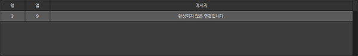

|항목|설명|
|:---:|:---|
|행|문제가 발생한 칸의 행 표시|
|열|문제가 발생한 칸의 열 표시|
|메시지|문제 내용 표시|

<br />

* **상태표시줄**

|아이콘|설명|
|:---:|:---|
||작업 영역의 커서 위치 표시|
||연결된 장치 상태 표시|

<br />

---

<br />


### 1-2 프로젝트 정보
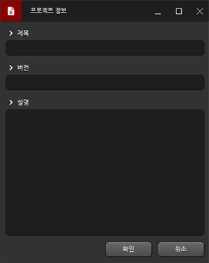

<br />

|항목|설명|
|:---:|:---|
|제목|프로젝트 제목|
|버전|프로젝트 버전|
|설명|프로젝트 내용이나 기타 설명|

<br />

---

<br />

### 1-3 심볼

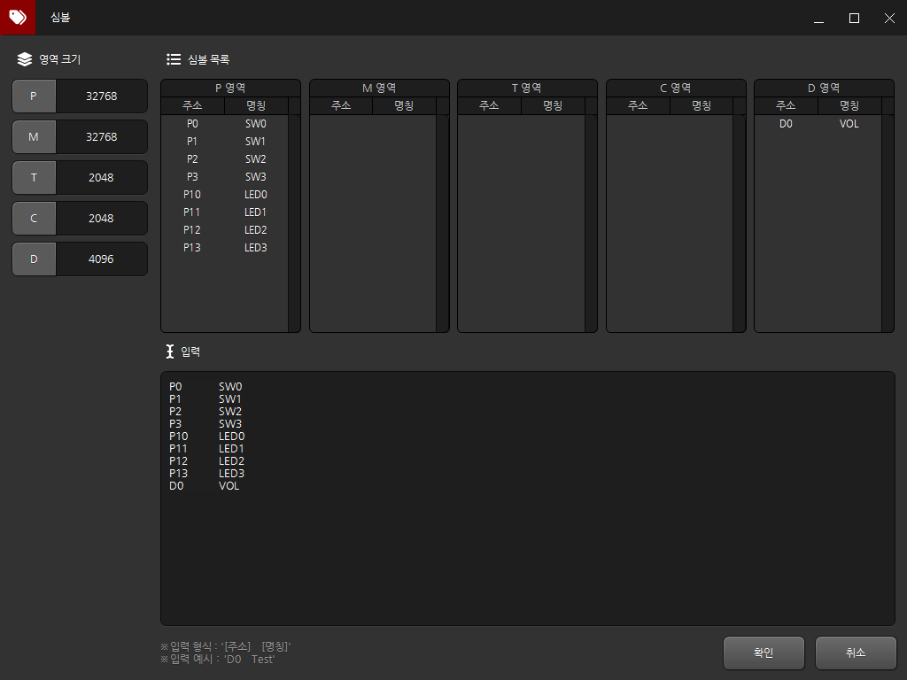

<br />

* **영역 크기**

|항목|기본값|설명|
|:---:|:---:|:---|
|P|32768|입출력 접점 크기 지정|
|M|32768|내부 접점 크기 지정|
|T|2048|타이버 영역 크기 지정|
|C|2048|카운터 영역 크기 지정|
|D|4096|데이터 영역 크기 지정|

<br />

* **심볼 내역**

심볼은 M0, P0등의 주소 형식을 별칭으로 지정하는 기능  

심볼 내역에서는 이 심볼을 등록/수정/삭제 할 수 있음

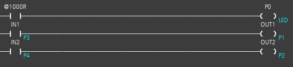  

```
심볼 적용 시 작업 영역에선 위와 같은 형식으로 표시 
```

<br />

---

<br />

### 1-4 통신

레더에서 동작될 통신을 등록/수정/삭제

* **통신 내역**

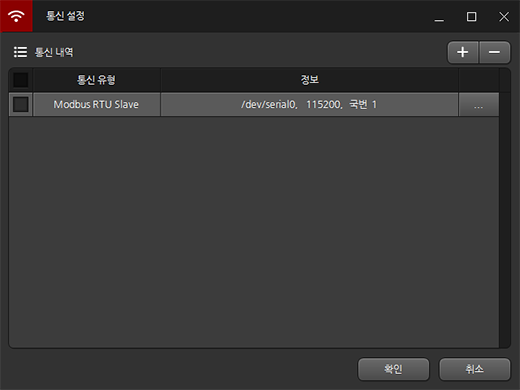 

|항목|설명|
|:---:|:---|
|통신 유형|등록된 통신의 종류 표시|
|정보|등록된 통신의 요약 정보 표시|
|...|등록된 통신을 수정|

<br />

* **ModbusRTU Slave**

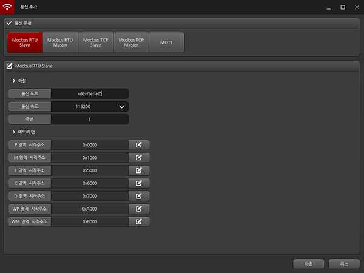 

```
/dev/serial0 포트에서 통신속도 115200으로 ModbusRTU Slave 통신 동작

각 영역의 모드버스 기본 주소는 위 이미지에 기입되어 있고 주소는 수정 가능    
```

<br />

* **ModbusRTU Master**

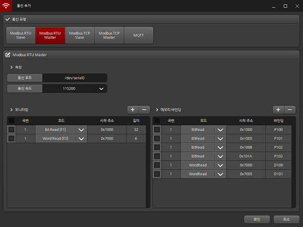 

```
/dev/serial0 포트에서 통신속도 115200으로 ModbusRTU Master 통신 동작

국번 1번 장치의 0x1000 ~ 0x101F 까지의 접점과 0x7000 ~ 0x7005 까지 데이터를 지속적으로 모니터링

국번 1번 장치에서 모니터링 중인 0x1000번지 접점을 P100과 바인딩

위와 마찬가지로 0x1005, 0x100B, 0x101A, 0x7000, 0x7005를 각각의 접점이나 데이터 영역에 바인딩
```

<br />

* **ModbusTCP Slave**

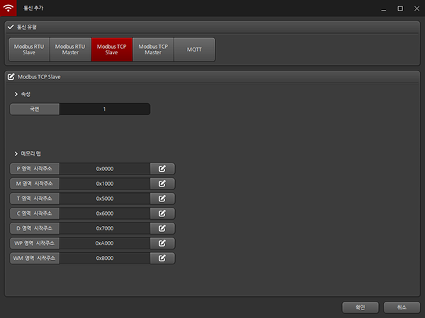 

```
국번 1번 장치로 ModbusTCP Slave 통신 동작

각 영역의 모드버스 기본 주소는 위 이미지에 기입되어 있고 주소는 수정 가능    
```

<br />

* **ModbusTCP Master**

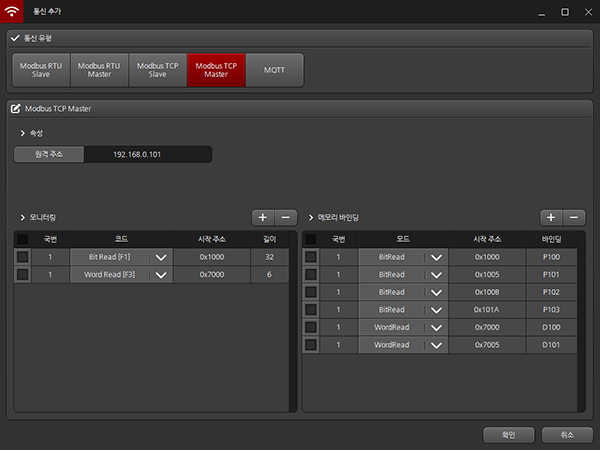 

```
192.168.0.101 주소의 장치에 연결하여 ModbusTCP Master 통신 동작

국번 1번 장치의 0x1000 ~ 0x101F 까지 접점과 0x7000 ~ 0x7005 까지 데이터를 지속적으로 모니터링

국번 1번 장치에서 모니터링 중인 0x1000번지 접점을 P100과 바인딩

위와 마찬가지로 0x1005, 0x100B, 0x101A, 0x7000, 0x7005를 각각의 접점이나 데이터 영역에 바인딩
```

<br />

* **MQTT**

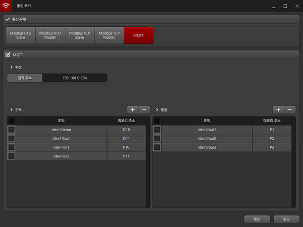 

```
192.168.0.254의 브로커에 연결하여 

/dev1/temp 토픽으로 들어오는 값을 D10에 적재  
/dev1/hum 토픽으로 들어오는 값을 D11에 적재  
/dev1/in1 토픽으로 들어오는 값을 P10에 적재  
/dev1/in2 토픽으로 들어오는 값을 P11에 적재  

P1의 값의 변화 발생 시 /dev1/out1로 값 발행  
P2의 값의 변화 발생 시 /dev1/out2로 값 발행  
P3의 값의 변화 발생 시 /dev1/out3로 값 발행  
```

<br />

---

<br />

### 1-5 라이브러리

* **라이브러리**  
 
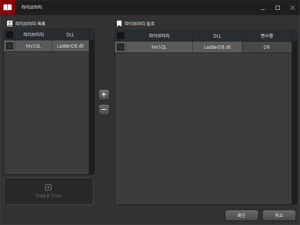

```
라이브러리는 레더 엔진 기본 기능외 추가적인 기능 사용을 위해 제공하는 DLL을 등록 및 사용하는 기능

LadderDB.dll은 데이터베이스와 연동할 수 있는 샘플 DLL로 MySQL과 연결이 가능

위 이미지에서는 MySQL 기능을 사용하기 위한 접근 변수명을 DB라 지정 
```
<br />


* **작업 영역**

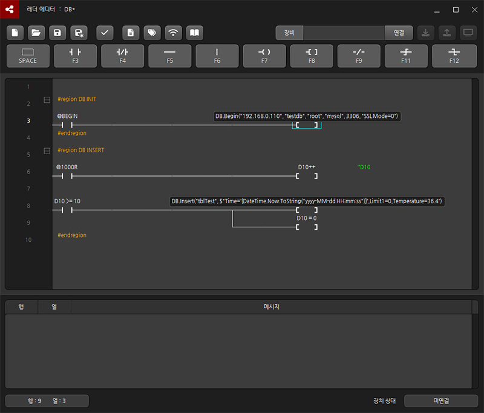

``` 
위 레더를 분석해보면

1. 레더 프로그램 시작 시 DB.Begin 함수를 호출하여 DB 연결 정보를 입력 

2. 1초에 한번 D10을 1씩 증가

3. D10이 10이상 시 DB.Insert를 통해 Time=[현재시간], Limit1=0, Temperature=36.4라는 값을 넣고 D10초기화

즉, 본 프로그램은 10초에 한 번씩 주기적으로 DB에 Time, Limit1, Temperature 정보를 기록함
```
 
<br />

<br />

<br />

<br />

## 2 명령어

### 2-1 특수 릴레이

|릴레이|설명|
|:---:|:---|
|@BEGIN|유저 설정 사용시 첫 1회 스캔만 동작|
|@10R|약 10ms 간격으로 ON 신호 반복|
|@100R|약 100ms 간격으로 ON 신호 반복|
|@1000R|약 1000ms 간격으로 ON 신호 반복|
|@F10R|약 10ms 간격으로 ON/OFF 신호 반복|
|@F100R|약 100ms 간격으로 ON/OFF 신호 반복|
|@F100R|약 1000ms 간격으로 ON/OFF 신호 반복|
|@ON|상시 ON 상태|
|@OFF|상시 OFF 상태|
 
<br />

---

<br />

### 2-2 데이터 표현형

* **더블 워드**


```
D10.DW에 1씩 누적하여 현재값은 65610이 들어가 있음

65610은 16진수로 0001 004A

각 값은 아래와 같이 대입된다

D10 : 74 (0x004A) / 하위 워드
D11 :  1 (0x0001) / 상위 워드
```

<br />

* **실수**


```
D10을 10ms 마다 1씩 증가

D20.R에 D10의 값을 100으로 나눠서 대입

현재 D10에는 2390이 들어가 있으며 D20에는 2390 / 100 인 23.9가 들어가 있음 

실수는 2개 워드를 사용하여 위 에서는 D20, D21을 사용
```

<br />

* **문자열**


```
1초에 한 번 D1을 증가시켜

D1을 2로 나눈 나머지가 0이면 D10.S4에 "짝수", 1이면 "홀수"를 대입

현재 D1의 값은 51, 나머지가 1이기 때문에 D10.S4에는 "홀수"가 들어가 있음

.S 다음에 오는 숫자는 문자열 버퍼의 크기로 단위는 워드이다

D10.S4는 D10부터 4개 워드를 사용하는 것으로 D10, D11, D12, D13을 문자열 버퍼로 사용한다.

영문/숫자는 1개 워드에 2개 문자를 사용할 수 있으며 한글은 1개 워드에 1개 문자를 사용한다.
```

<br />

* **비트**

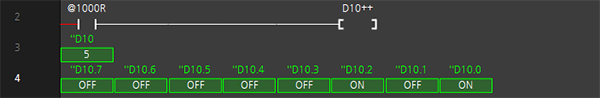

```
1초에 한 번 D10을 1씩 증가시켜 D10을 모니터링 한다

모니터링 항목은 D10의 워드 값과 D10의 0~7 까지 비트 표시한다

현재 D10의 값은 5이며 각 비트의 표시되는 On/Off를 0/1로 바꾸면

0000 0101로 2진수 101, 즉 10진수 5임을 확인할 수 있다.

비트 표현은 워드 영역에서만 사용할 수 있으며 D0.0 ~ D0.F 까지 16개 비트 표현이 가능하다.
```
 
<br />

---

<br />

### 2-3 연산자

* **수식 연산자**

|연산자|예시|설명|
|:---:|:---:|:---|
|+|a + b|a와 b를 더함|
|-|a - b|a에서 b를 뺌|
|*|a * b|a와 b를 곱함|
|/|a / b|a에서 b를 나눔|
|%|a % b|a를 b로 나눈 나머지|
 
<br />

* **증감 연산자**

|연산자|예시|설명|
|:---:|:---:|:---|
|++|a++|a를 1만큼 증가|
|--|a--|a를 1만큼 감소|
 
<br />

* **시프트 연산자**

|연산자|예시|설명|
|:---:|:---:|:---|
|<<|a << b|a의 비트를 b만큼 좌측으로 이동|
|>>|a >> b|a의 비트를 b만큼 우측으로 이동|
 
<br />

* **관계 연산자**

|연산자|예시|설명|
|:---:|:---:|:---|
|<|a < b|a가 b보다 작으면 참, 아니면 거짓|
|>|a > b|a가 b보다 크면 참, 아니면 거짓|
|==|a == b|a와 b가 같으면 참, 아니면 거짓|
|!=|a != b|a와 b가 다르면 참, 아니면 거짓|
|>=|a >= b|a가 b보다 크거나 같으면 참, 아니면 거짓|
|<=|a <= b|a가 b보다 작거나 같으면 참, 아니면 거짓|
 
<br />

* **대입 연산자**

|연산자|예시|설명|
|:---:|:---:|:---|
|=|a = b|a에 b를 대입|
|+=|a += b|a = a + b 와 같음|
|-=|a -= b|a = a - b 와 같음|
|*=|a *= b|a = a * b 와 같음|
|/=|a /= b|a = a / b 와 같음|
|%=|a %= b|a = a % b 와 같음|
|<<=|a <<= b|a = a << b 와 같음|
|>>=|a >>= b|a = a >> b 와 같음|

<br />

* **논리 연산자**

<table>
    <tr>
        <th align="center">연산자</th>
        <th align="center">예시</th>
        <th align="left">설명</th>
    </tr>
    <tr>
        <td align="center">&&</td>
        <td align="center">a && b</td>
        <td>a와 b 모두 참이면 참</td>
    </tr>
    <tr>
        <td align="center">||</td>
        <td align="center">a || b</td>
        <td>a나 b 하나라도 참이면 참</td>
    </tr>
    <tr>
        <td align="center">!</td>
        <td align="center">!a</td>
        <td>a가 참이면 거짓, 거짓이면 참</td>
    </tr>
</table>

<br />

* **비트 연산자**

<table>
    <tr>
        <th align="center">연산자</th>
        <th align="center">예시</th>
        <th align="left">설명</th>
    </tr>
    <tr>
        <td align="center">&</td>
        <td align="center">a & b</td>
        <td>a와 b의 비트 논리곱(and)</td>
    </tr>
    <tr>
        <td align="center">|</td>
        <td align="center">a | b</td>
        <td>a와 b의 비트 논리합(or)</td>
    </tr>
    <tr>
        <td align="center">^</td>
        <td align="center">a ^ b</td>
        <td>a와 b의 베타적 논리합(xor)</td>
    </tr>
</table>
 
<br />

---

<br />

### 2-4 함수

* **TON**
```
· 문법
TON( [릴레이], 설정값 )

릴레이 : T 릴레이만 사용가능
설정값 : 1 에서 65535 까지의 상수값 또는 D 레지스터 사용가능

· 설명
조건이 ON 되면 10ms 단위로 타이머가 증가되어 설정값에 도달 시 릴레이 ON
```

<br />

* **TAON**
```
· 문법

TAON( [릴레이], 설정값 )

릴레이 : T 릴레이만 사용가능
설정값 : 1 에서 65535 까지의 상수값 또는 D 레지스터 사용가능

· 설명

조건이 ON 되면 100ms 단위로 타이머가 증가되어 설정값에 도달 시 릴레이 ON
```

<br />

* **TOFF**
```
· 문법

TOFF( [릴레이], 설정값 )

릴레이 : T 릴레이만 사용가능
설정값 : 1 에서 65535 까지의 상수값 또는 D 레지스터 사용가능

· 설명

조건이 ON 되면 릴레이도 ON
이후 조건 OFF 시 10ms 단위로 타이머가 감소되어 설정값 만큼 경과 후 릴레이 OFF
```

<br />

* **TAOFF**
```
· 문법

TAOFF( [릴레이], 설정값 )

릴레이 : T 릴레이만 사용가능
설정값 : 1 에서 65535 까지의 상수값 또는 D 레지스터 사용가능

· 설명

조건이 ON 되면 릴레이도 ON
이후 조건 OFF 시 100ms 단위로 타이머가 감소되어 설정값 만큼 경과 후 릴레이 OFF
```

<br />

* **TMON**
```
· 문법

TMON( [릴레이], 설정값 )

릴레이 : T 릴레이만 사용가능
설정값 : 1 에서 65535 까지의 상수값 또는 D 레지스터 사용가능

· 설명

조건이 잠시라도 ON 되면 릴레이도 ON
이후 10ms 단위로 타이머가 증가되어 설정값에 도달 시 릴레이 OFF
```

<br />

* **TAMON**
```
· 문법

TAMON( [릴레이], 설정값 )

릴레이 : T 릴레이만 사용가능
설정값 : 1 에서 65535 까지의 상수값 또는 D 레지스터 사용가능

· 설명

조건이 잠시라도 ON 되면 릴레이도 ON
이후 100ms 단위로 타이머가 증가되어 설정값에 도달 시 릴레이 OFF
```

<br />

* **SETOUT**
```
· 문법

SETOUT( [릴레이] )

릴레이 : P, M 릴레이만 사용가능

· 설명

조건이 ON 되면 릴레이를 ON
```

<br />

* **RSTOUT**
```
· 문법

RSTOUT( [릴레이] )

릴레이 : P, M 릴레이만 사용가능

· 설명

조건이 ON 되면 릴레이를 OFF
```

<br />

* **MCS**
```
· 문법

MCS( 번호 )

번호 : MCS 번호

· 설명

레더를 블록 단위로 나누어서 제어할 수 있는 명령
블록의 시작
```

<br />

* **MCSCLR**
```
· 문법

MCSCLR( 번호 )

번호 : MCS 번호

· 설명

레더를 블록 단위로 나누어서 제어할 수 있는 명령
블록의 끝
```

<br />

* **WXCHG**
```
· 문법

WXCHG( 메모리1, 메모리2 )

메모리1 : 교환할 메모리1
메모리2 : 교환할 메모리2

· 설명

메모리 1과 메모리2 상호 교환
```

<br />

* **DIST**
```
· 문법

DIST( 메모리1, 메모리2, 개수 )

메모리1 : 소스 메모리
메모리2 : 타깃 메모리 시작
개수 : 메모리에 저장할 개수

· 설명

16비트 값을 4비트 단위로 분할하여 타깃 메모리에 저장
```

<br />

* **UNIT**
```
· 문법

UNIT( 메모리1, 메모리2, 개수 )

메모리1 : 소스 메모리 시작
메모리2 : 타깃 메모리
개수 : 메모리에 저장할 개수

· 설명

지정한 메모리들의 하위 4비트 합쳐 타깃 메모리에 저장
```

<br />

