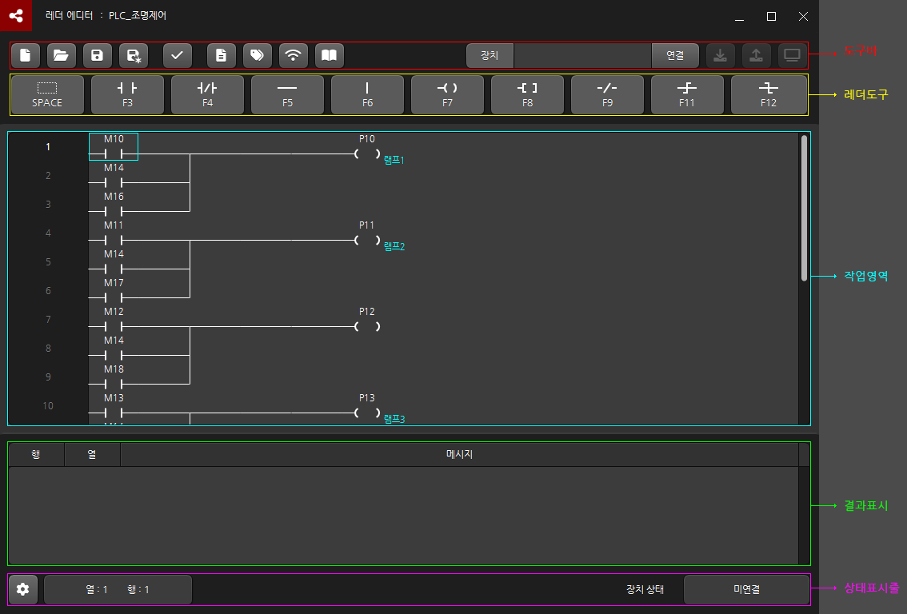
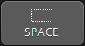
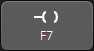
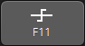

# LaddrEditor

## 개요
* PLC 레더를 작성/배포/모니터링 할 수 있는 개발툴
* Devinno.PLC의 LadderEngine 과 연동하여 PLC 기능 수행

<br />
<br />  

## 목차
 * 사용법
   * [화면 구성](#화면-구성)
   * [에디터 편집](#에디터-편집)
   * [프로젝트 정보](#프로젝트-정보)
   * [심볼](#심볼)
   * [통신](#통신)
   * [라이브러리](#라이브러리)
 * 명령어
   * [특수 릴레이](#특수-릴레이)
   * [연산자](#연산자)
   * [함수](#함수)


<br />
<br />  


## 사용법

### 화면 구성


* **도구바**

|아이콘|명칭|설명|
|:---:|:---:|:---:|
||새 파일|파일을 새로 생성합니다|
||열기|기존 파일을 불러옵니다|
||저장|작업중인 파일을 저장합니다|
||다른 이름으로 저장|작업중인 파일을 새로운 이름으로 저장합니다|
||유효성 체크|작업중인 레더 로직의 유효성을 체크합니다|
||프로젝트 정보|프로젝트 정보를 입력합니다|
||심볼|장치 영역 크기를 지정하거나 심볼을 등록합니다|
||통신|통신을 등록합니다|
||라이브러리|라이브러리를 등록하고 인스턴스를 생성합니다|
||다운로드|연결된 레더 엔진의 작업중인 레더문서를 다운로드합니다|
||업로드|연결된 레더 엔진의 동작중인 레더문서를 업로드합니다|
||모니터링|연결된 레더엔진을 모니터링합니다|

* **레더도구**

|아이콘|단축키|명칭|설명|
|:---:|:---:|:---:|:---:|
||Space|삭제|커서 위치의 항목을 삭제합니다|
||F3|A 접점|커서 위치에 A접점을 등록합니다|
||F4|B 접점|커서 위치에 B접점을 등록합니다|
||F5|H 라인|커서 위치에 레더 연결을 위한 수평 라인을 등록합니다|
||F6|V 라인|커서 위치에 레더 연결을 위한 수직 라인을 등록합니다|
||F7|출력|커서 위치에 접점 출력을 등록합니다|
||F8|함수|커서 위치에 함수 호출을 등록합니다|
||F9|반전|커서 위치에 입력 반전을 등록합니다|
||F11|상승 엣지|커서 위치에 상승 엣지를 등록합니다|
||F12|하강 엣지|커서 위치에 하강 엣지를 등록합니다|

### 에디터 편집
```
```
### 프로젝트 정보
```
```
### 심볼
```
```
### 통신
```
```
### 라이브러리
```
```

<br />
<br />  

## 명령어

### 특수 릴레이
```
```
### 연산자
```
```
### 함수
```
```